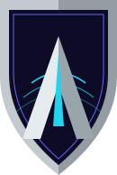
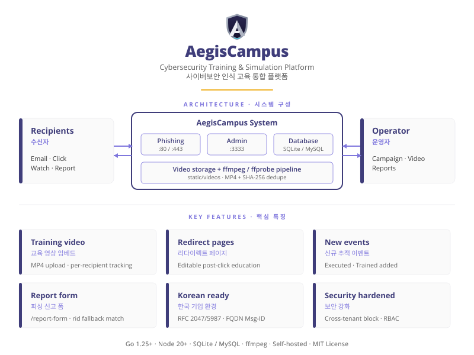

<p align="center">
  
</p>

<h1 align="center">AegisCampus</h1>

<p align="center">
  Cybersecurity training & phishing simulation, in one platform.<br/>
  악성메일 모의훈련과 사이버보안 교육을 하나의 플랫폼에서
</p>

<p align="center">
  
  
  
</p>

---

<p align="center">
  
</p>

## 개요 / Overview

**AegisCampus** 은 피싱 시뮬레이션과 보안 인식 교육 영상을 하나의 도구에서 통합 운영할 수 있는 자체 호스트 플랫폼입니다. "잘못된 클릭 → 즉시 교육 영상 → 수강 완료 추적" 흐름으로, 시뮬레이션 그 자체로 끝내지 않고 학습 효과까지 캠페인 보고서에 통합합니다.

*AegisCampus is a self-hosted platform that combines phishing simulation with embedded video training. Beyond simulating attacks, it tracks whether employees who fell for a campaign actually watched and completed the assigned training video — the `Trained` event joins the existing `Sent → Opened → Clicked → Submitted` timeline, giving security teams a complete picture from compromise to remediation.*

## 핵심 특징 / Key features

- **교육 영상 임베드** — MP4 업로드 후 랜딩 페이지 또는 리다이렉트 페이지에 임베드. 수신자별 시청 진행률 및 수강 완료 (`Trained` 이벤트) 추적
- **리다이렉트 페이지** — 캠페인 클릭 후 보여줄 자체 교육 페이지. 단순 `redirect_url` 을 영상 임베드 가능한 편집 가능 페이지로 확장
- **신규 추적 이벤트** — `Executed` (첨부 실행) + `Trained` (교육 영상 수강 완료) 두 가지 이벤트 추가
- **피싱 신고 폼** — 수신자 친화적 `/report-form` 엔드포인트. `rid` 토큰이 없거나 만료되어도 이메일 + 제목 fallback 매칭
- **한국 기업 환경 호환** — `name` / `department` 스키마, RFC 2047 제목 인코딩, RFC 5987 첨부 파일명, FQDN 기반 `Message-ID` (Gmail 5.7.1 회피)
- **보안 강화** — cross-tenant 영상 접근 차단, 첨부 업로드에 `ModifyObjects` 권한 강제, JSON `PUT /api/videos/{id}` 화이트리스트 컬럼

자세한 변경 내역은 [CHANGELOG.md](CHANGELOG.md) 참조.

## 요구 사항 / Requirements

- **Go** 1.25.0 이상 (toolchain 1.26.3 권장)
- **Node.js** 20 이상 (`gulp scripts` / `gulp styles` 빌드용)
- **ffmpeg** + **ffprobe** (PATH 또는 환경변수로 경로 지정)
- **SQLite3** (기본) 또는 **MySQL**

## 빌드 / Build from source

```
git clone https://github.com/AegisAX/AegisCampus.git
cd AegisCampus

# 프론트엔드 자산 빌드 (JS 압축 + CSS 번들)
npx gulp build

# 백엔드 바이너리 빌드
go build -ldflags="-s -w" -trimpath -o aegiscampus .
```

빌드 산출물은 `./aegiscampus` 바이너리 + `static/` + `templates/` + `db/` + `VERSION` 디렉터리 묶음입니다.

## 첫 실행 / First run

```
./aegiscampus
```

첫 실행 시 초기 admin 비밀번호가 로그에 출력됩니다 (`AEGISCAMPUS_INITIAL_ADMIN_PASSWORD` 환경변수로 지정 가능). 브라우저에서 `https://localhost:3333/` 접속 후 로그인.

## 설정 / Configuration

`config.json` 으로 admin 서버 (`:3333`), phishing 서버 (`:8088`), DB 드라이버, TLS 설정을 관리합니다. 런타임 환경변수:

| 변수 / Variable | 기본값 / Default | 설명 / Purpose |
|---|---|---|
| `AEGISCAMPUS_FFMPEG` | `ffmpeg` | ffmpeg 바이너리 경로 |
| `AEGISCAMPUS_FFPROBE` | `ffprobe` | ffprobe 바이너리 경로 |
| `AEGISCAMPUS_MAX_VIDEO_BYTES` | `524288000` (500 MB) | 영상 업로드 상한 (예: `1073741824` = 1 GB) |
| `AEGISCAMPUS_MSGID_DOMAIN` | (envelope sender 도메인) | `Message-ID` 헤더용 FQDN (Gmail 발송 시 권장) |
| `AEGISCAMPUS_INITIAL_ADMIN_PASSWORD` | (자동 생성) | 첫 부팅 시 초기 admin 비밀번호 |
| `AEGISCAMPUS_INITIAL_ADMIN_API_TOKEN` | (자동 생성) | 첫 부팅 시 초기 admin API 토큰 |

## Docker

```
docker build -t aegiscampus .
docker run -p 3333:3333 -p 8088:8088 aegiscampus
```

## 릴리스 절차 / Release procedure

운영 환경 배포는 다음 5단계로 진행:

### 1. 버전 갱신

```
echo "1.0.0-rc1" > VERSION
```

[CHANGELOG.md](CHANGELOG.md) 에 해당 버전 섹션 추가.

### 2. 빌드

```
npx gulp build
go build -ldflags="-s -w" -trimpath -o aegiscampus .
```

### 3. 운영 디렉터리 배포

```
cp -arv aegiscampus db/ static/ templates/ VERSION ~/AegisCampus/
```

⚠️ 운영 DB 파일 (`~/AegisCampus/aegiscampus.db`) 은 덮어쓰지 마세요. 빌드 디렉터리의 `db/` 는 마이그레이션 파일 (`.sql`) 만 포함합니다.

### 4. 운영 환경 재시작

```
cd ~/AegisCampus/
pkill aegiscampus
./aegiscampus &
```

로그에서 마이그레이션 적용 결과 확인.

### 5. Git 태그 + GitHub Release

```
git tag -a v1.0.0-rc1 -m "v1.0.0-rc1"
git push origin v1.0.0-rc1
```

GitHub 웹 UI 에서 `Releases > Draft a new release` → tag 선택 → CHANGELOG.md 의 해당 섹션 복사하여 release notes 작성 → `Publish release`.

## 문서 / Documentation

자체 호스트 문서는 준비 중입니다. 현재로서는 다음을 참고:

- [CHANGELOG.md](CHANGELOG.md) — 기능 인벤토리 및 릴리스 노트
- 소스 코드 `controllers/`, `models/`, `util/` — 동작 상세

## 이슈 / Issues

버그, 기능 요청, 문서 누락 모두 환영합니다. [이슈 등록](https://github.com/AegisAX/AegisCampus/issues).

---

<p align="center">
  <sub>AegisCampus is distributed under the MIT License. See <a href="LICENSE">LICENSE</a> for details.</sub>
</p>
