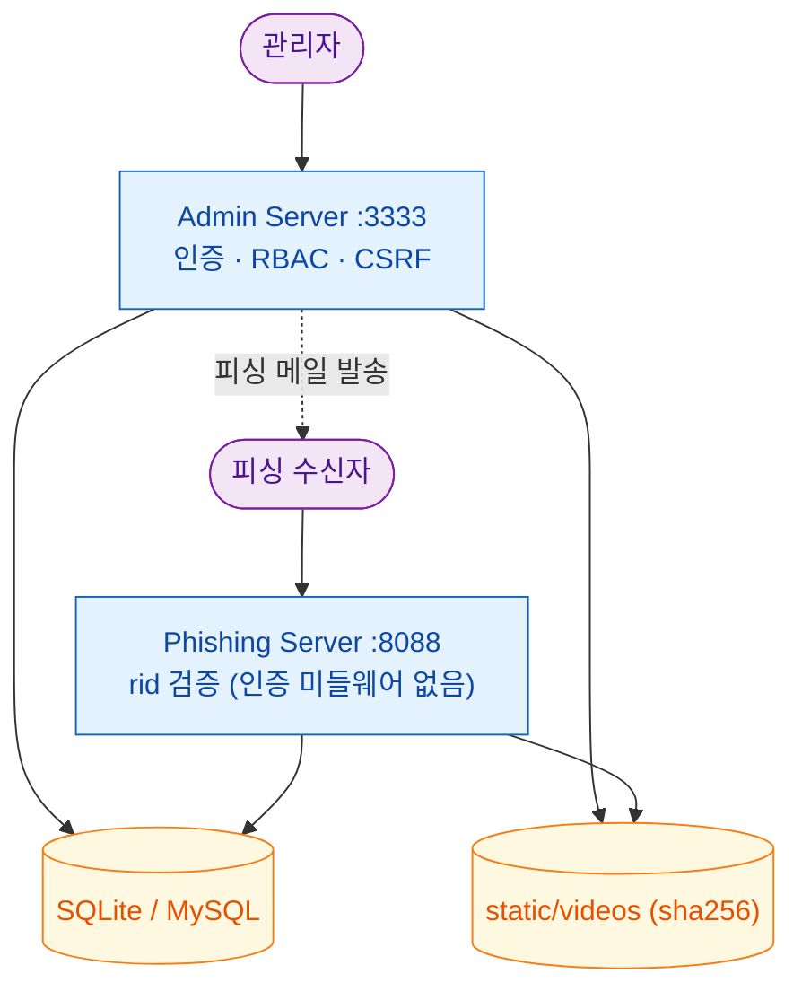
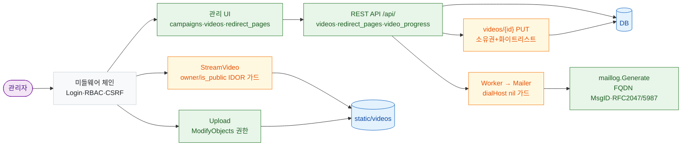
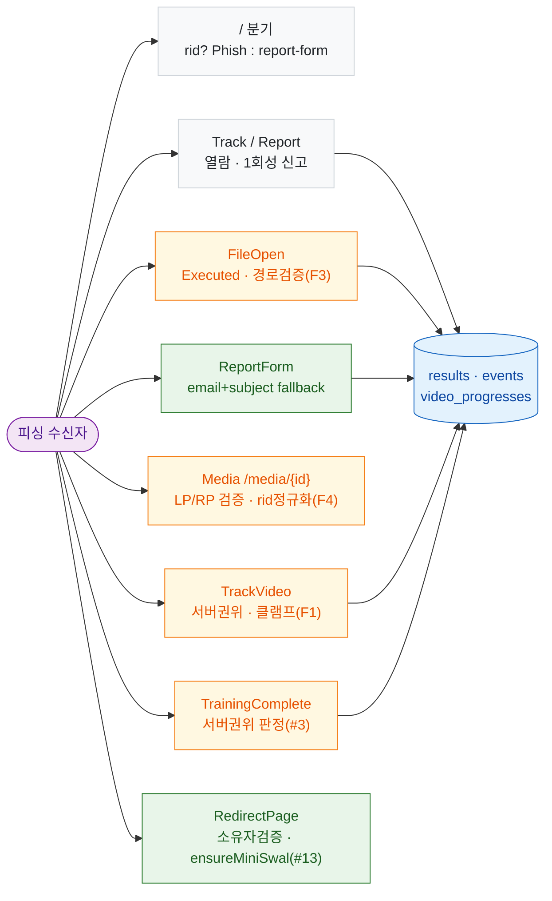
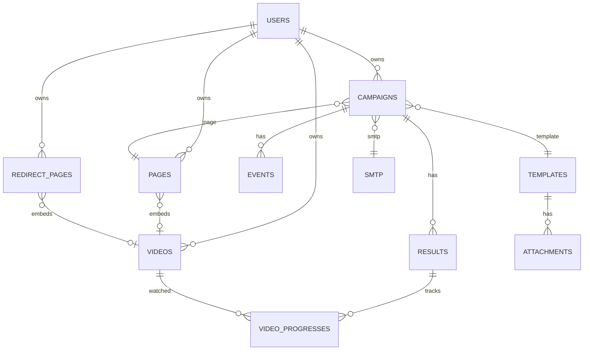
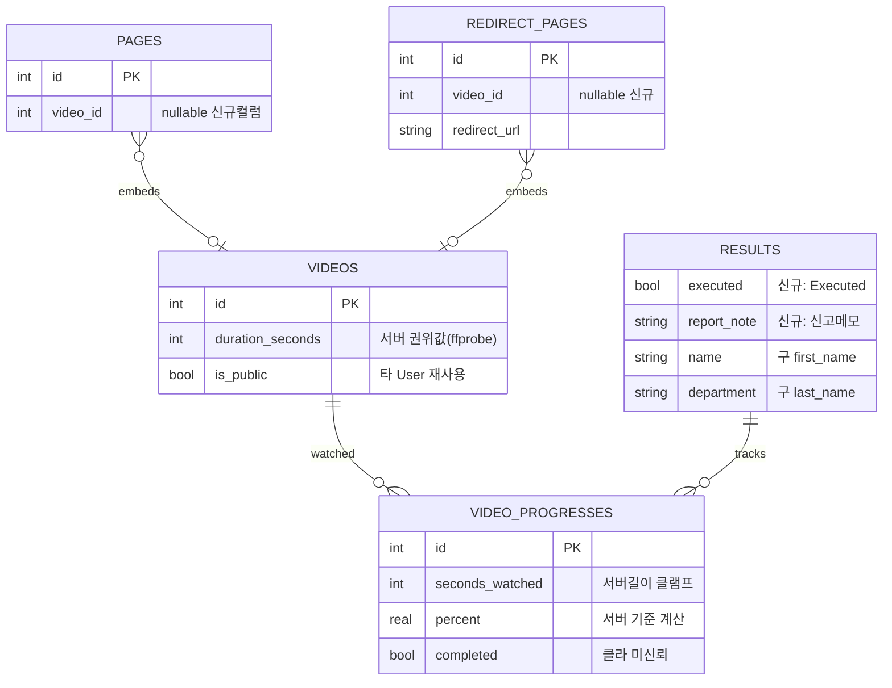
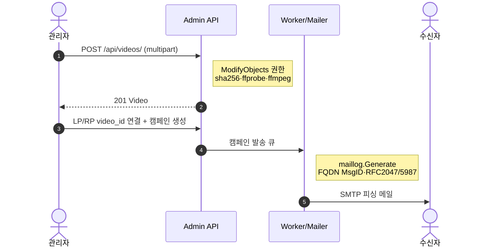
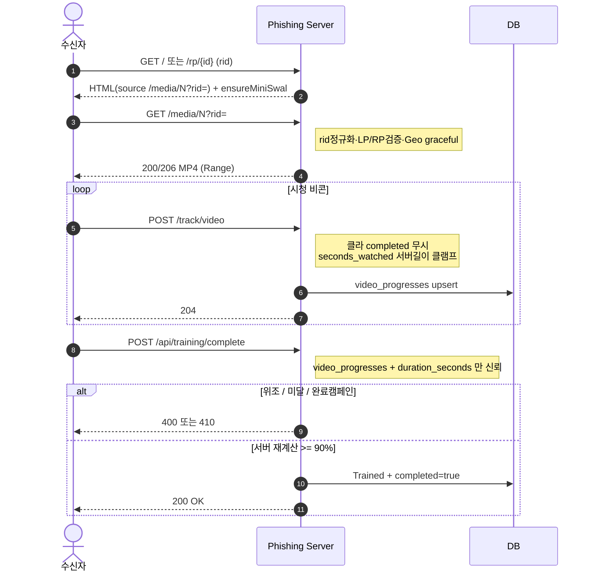
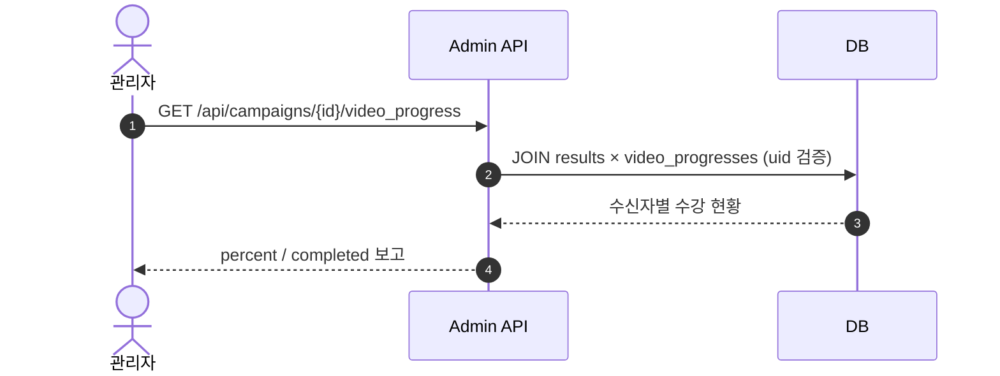

# Sentinel 아키텍처 & 설계 문서

- 버전: v1.0.0-rc1
- 발행일: 2026-05-19
- 베이스: GoPhish 0.12.1 fork
- 성격: Sentinel 의 **첫 공식 설계 문서**. 본 문서는 v1.0.0-rc1 코드를 1차 출처로 기술하며, 이전 베타 단계의 변경 이력은 릴리스 노트(CHANGELOG)에서 관리한다.

> 이 문서는 현재 코드(`v1.0.0-rc1`) 기준으로 직접 추출한 라우트·미들웨어·데이터 모델·마이그레이션 등의 내용을 근거로 작성되었다. 향후 코드 변경 시 본 문서와 `docs/*.mmd` 다이어그램 소스를 같은 변경 단위에서 갱신한다.

## 목차

1. 개요
2. 시스템 아키텍처
3. 데이터 모델
4. 라우팅 & 핸들러
5. 핵심 사용자 흐름
6. 보안 모델
7. 핵심 컴포넌트 상세
8. 마이그레이션
9. 빌드 / 배포 / 환경 변수
10. 알려진 제한 + 로드맵
11. rc1 안정화 품질 기록
- 부록 A. 핵심 코드 위치 인덱스

---

## 1. 개요

### 1.1 Sentinel 이란

Sentinel 은 GoPhish 0.12.1 의 피싱 시뮬레이션 기능을 **사이버보안 인식 교육이 통합된 종합 플랫폼**으로 확장한 프로젝트다.
핵심 가치는 "누가 클릭했는가" 를 넘어, 잘못 클릭한 대상자에게 즉시 교육 영상을 송출하고 그 **수강 여부까지 캠페인 보고서에서 추적**하는 데 있다.

### 1.2 GoPhish 0.12.1 대비 핵심 차별점

| 영역 | GoPhish 0.12.1 | Sentinel |
| --- | --- | --- |
| 영상 교육 | - | 동영상 업로드·스트리밍·수강률 추적 |
| Redirect Pages | - | 캠페인 종료 후 교육 페이지 |
| 수신자 흐름 | 클릭 → 랜딩 → 외부 redirect_url | 클릭 → 랜딩(영상 임베드 가능) → 자체 RedirectPage(교육) 또는 외부 URL |
| 추적 이벤트 | Sent/Opened/Clicked/Submitted/Reported | + Executed(첨부 실행) + Trained(수강 완료) |
| 신고 흐름 | report 토큰 1회성 | /report-form, rid 없어도 이메일+제목 fallback, 사유 메모 |
| 타겟 스키마 | first_name / last_name | name / department (한국 기업 환경) |
| 다국어 메일 | 영문 위주 | RFC 2047 제목 + RFC 5987 첨부 filename* + ASCII 폴백 |
| 메일 호환성 | 표준 SMTP | FQDN 기반 Message-ID (Gmail 5.7.1 회피) |
| 통계 | 클릭/제출 중심 | + 영상 수강률 (수신자별 + 캠페인 집계) |
| 수강 완료 판정 | - | **서버 권위 단독 판정** (클라이언트 자가증명 차단) |

### 1.3 규모

- 신규 모델 3개: Video, VideoProgress, RedirectPage
- 신규 유틸 패키지: util/mimeutil (RFC 2047/5987)
- Sentinel-era 마이그레이션 10건 (SQLite + MySQL 동일 구조)
- 신규 phishing 라우트 다수 + 신규 admin/API 라우트 (4장 참조)

---

## 2. 시스템 아키텍처

가독성을 위해 전체 개요 → 관리자 측 → 사용자(피싱 수신자) 측 순으로 분할 제시한다.
다이어그램 소스: `docs/architecture-overview.mmd`, `docs/architecture-admin.mmd`, `docs/architecture-user.mmd`.

### 2.1 시스템 개요



- **Admin Server (:3333)** — 운영자 전용. 세션 인증 + RBAC + CSRF + Rate Limit + Security Headers.
- **Phishing Server (:8088)** — 외부 노출. 수신자 브라우저가 직접 접근. 인증 미들웨어 없이 라우트별 rid 토큰 + path traversal 방어 + 캠페인 상태 검증을 직접 수행.
- **Persistence** — SQLite3(단일) 또는 MySQL. 영상 자산은 로컬 파일시스템 (`static/videos`, sha256 파일명).

### 2.2 관리자 측 구성도



### 2.3 사용자(피싱 수신자) 측 구성도



### 2.4 레이어 분리

- **Phishing Server (:8088)** — 외부 노출. 수신자 브라우저가 직접 접근. CSRF/인증 미들웨어 없이 작동하며, 라우트별로 rid 토큰 + path traversal 방어 + 캠페인 상태 검증을 직접 수행한다.
- **Admin Server (:3333)** — 운영자 전용. 세션 인증 + RBAC + CSRF + Rate Limit + Security Headers.
- **Persistence** — SQLite3(단일 인스턴스) 또는 MySQL. goose 마이그레이션. 영상 자산은 로컬 파일시스템(`static/videos`, `static/videos/thumbs`).

두 서버는 별도 포트 + 별도 라우터로 분리된다.
운영에서 admin 포트는 프록시 (NPMplus) 또는 방화벽으로 보호한다.

### 2.5 Admin 미들웨어 체인

코드(`controllers/route.go`) 기준, 요청 입장 순서:

1. Combined Logging (`handlers.CombinedLoggingHandler`)
2. Proxy Headers (`handlers.ProxyHeaders` — X-Forwarded-For/X-Real-IP)
3. GZIP 압축 (`gziphandler`, BestCompression)
4. Security Headers (`mid.ApplySecurityHeaders`)
5. Context 설정 (`mid.GetContext`)
6. CSRF 예외 + CSRF 검증 (`mid.CSRFExceptions` → `csrf.Protect`)
7. 라우트별 `RequireLogin` / `RequirePermission(...)`

Phishing 서버는 위 체인을 거치지 않는다.

---

## 3. 데이터 모델

### 3.1 엔티티 관계 개요

전체 관계 맵(컬럼 생략).
소스: `docs/er-overview.mmd`.



### 3.2 rc1 핵심 엔티티 상세

영상/교육 도메인의 신규·변경 컬럼만. 소스: `docs/er-detail.mmd`.



### 3.3 신규 테이블

- **videos** — 영상 자산 카탈로그. 파일명 = SHA-256 해시(동일 영상 재업로드 시 임시 파일 폐기 → 기존 파일 재참조, 자동 중복 제거). `is_public` = 다른 User 가 자기 캠페인에 재사용 가능. 삭제는 `CountVideosByFileName` 으로 마지막 참조일 때만 디스크 파일 제거. `duration_seconds` 는 ffprobe 가 설정하며 수강 완료 판정의 서버 권위값이다.
- **video_progresses** — 수강 진행. 자연 키 `(user_id, result_id, video_id)` (인덱스로 보장, Save() upsert). `seconds_watched` 는 단조 증가하며 서버 보유 `videos.duration_seconds` 로 상한 클램프된다. `percent`/`completed` 는 서버 길이 기준으로만 계산되고, 클라이언트가 보낸 `completed` 불리언은 신뢰하지 않는다.
- **redirect_pages** — 캠페인 종료 후 교육 페이지. `VideoId *int64` (nullable, Validate() 에서 0→NULL 정규화). `GetRedirectPages()` 는 video_id 수집 후 단일 IN 쿼리로 N+1 회피. `GetRedirectPageByID()` 는 user 필터 없이 조회(외부 핸들러용, 호출자가 소유권 검증).

### 3.4 기존 테이블 변경

- **pages** — `+ video_id (*int64, nullable)`, 0→NULL 정규화.
- **results** — `+ executed (BOOL)`, `+ report_note (TEXT)`, `first_name→name`, `last_name→department`.
- **events** — 라벨 정규화(Email Sent→Sent 등 5종) + 신규 2종 (Executed, Trained). `20250829000000_normalize_event_labels` 가 `events.message` + `results.status` 양쪽을 일괄 변환(멱등).

---

## 4. 라우팅 & 핸들러

코드(`controllers/phish.go`, `controllers/route.go`, `controllers/api/server.go`)에서 직접 추출.

### 4.1 Phishing Server (외부 노출, 인증 미들웨어 없음)

| 라우트 | Method | 핸들러 | 보호 / 비고 |
| --- | --- | --- | --- |
| /static/ | GET | FileServer(`./static/endpoint/`) | NoIndexDir |
| /track, /{path}/track | GET | TrackHandler | rid 토큰. 메일 열람 픽셀 |
| /report, /{path}/report | GET | ReportHandler | rid 토큰. 1회성 신고 |
| /robots.txt | GET | RobotsHandler | - |
| /fileopen | GET | FileOpenHandler | rid + `isSafeInternalPath`. Executed 이벤트 |
| /report-form | GET/POST | ReportFormGet/Post | rid + email+subject fallback. report_note |
| /media/{id} | GET | Media | rid → LP/RP video_id 연결 검증. Range 지원 |
| /track/video | POST | TrackVideo | rid + 캠페인 상태. 서버 권위 진행률 |
| /track/video/progress | GET | GetVideoProgress | 이어보기. 읽기 전용 |
| /api/training/complete | POST | TrainingCompleteHandler | rid + 서버 권위 완료 판정 |
| /rp/{id} | GET | RedirectPageHandler | rid↔RP 소유자 일치 검증 |
| / | GET | (분기) | rid 있으면 PhishHandler, 없으면 /report-form 302 |
| /{path:.*} | (기타) | PhishHandler | 캐치올 — 랜딩 렌더 |

### 4.2 Admin Server (RequireLogin 기본)

| 라우트 | 권한 | 비고 |
| --- | --- | --- |
| /, /login, /logout, /campaigns(/{id}), /templates, /groups, /landing_pages, /sending_profiles, /settings, /reset_password | RequireLogin | 기존 GoPhish |
| /redirect_pages | RequireLogin | RedirectPage 관리 UI |
| /videos | RequireLogin | 영상 관리 UI |
| /videos/stream/{id} | RequireLogin | StreamVideo — owner 또는 is_public IDOR 가드 |
| /videos/upload | RequirePermission(ModifyObjects) + RequireLogin | 멀티파트 업로드 |
| /videos/thumb/{id} | RequireLogin | 썸네일 |
| /media/{id} (admin) | RequireLogin | StreamVideo 공유 — 동일 IDOR 가드 |
| /users, /webhooks, /impersonate | RequirePermission(ModifySystem) + RequireLogin | Admin 전용 |

### 4.3 REST API (/api/ 서브라우터)

campaigns(/{id}, /results, /summary, /complete), `campaigns/{id}/results/ {rid}/report` DELETE(신고 취소), `campaigns/{id}/video_progress` GET, groups, templates, pages, `redirect_pages/`(GET/POST)·`redirect_pages/{id}`, `videos/`(GET/POST)·`videos/{id}`(GET/PUT/DELETE — PUT 화이트리스트: name/description/is_public), smtp, users(ModifySystem), util/send_test_email, import/*, webhooks(ModifySystem).

---

## 5. 핵심 사용자 흐름

### 5.1 영상 업로드 파이프라인 (ProcessVideoUpload)

`util.ProcessVideoUpload` 파이프라인: ① 디렉터리 준비 (static/videos[/thumbs], 0755) ② 임시 파일에 io.Copy 하며 SHA-256 동시 계산 (io.MultiWriter) ③ 최종 파일명 = sha256hex + 원본 확장자 ④ 동일 해시 존재 시 임시 폐기(자동 중복 제거) ⑤ ffprobe 로 duration 감지(클라 hint 0 일 때만) ⑥ ffmpeg 썸네일(동적 시점) ⑦ DB INSERT.

PUT `/api/videos/{id}` 는 소유권 확인(불일치 403) 후 화이트리스트 (name/description/is_public)만 갱신한다.
`user_id`/`file_*`/`duration_seconds` 는 PUT 으로 변경 불가(데이터 파괴 + 소유권 양도 차단).

### 5.2 관리자 — 영상 업로드 & 캠페인 발송

소스: `docs/sequence-admin.mmd`.



### 5.3 수신자 — 영상 시청 → 수강 완료 (서버 권위 판정)

소스: `docs/sequence-user.mmd`.



설계 원칙 — 수강 완료 판정은 전적으로 서버 권위다.
`/track/video` 는 진행률 비콘으로, 클라이언트가 보낸 `completed` 는 무시하고 `seconds_watched` 를 서버 보유 `videos.duration_seconds` 로 상한 클램프하며 `percent`/`completed` 를 서버 길이 기준으로만 계산한다.
`/api/training/complete` 는 `video_progresses` + `videos.duration_seconds` 만 신뢰해 90% 를 재계산하며, 위조된 duration/completed 는 400, 완료 캠페인은 410, 잘못된 video_id 는 400 이다.
통과 시에만 `events` 에 Trained 추가 + `video_progresses.completed=true`.

### 5.4 관리자 — 캠페인 수강률 확인

소스: `docs/sequence-report.mmd`.



### 5.5 LandingPage → RedirectPage (캠페인 종료 후)

운영자가 LP 의 redirect_url 을 `/rp/N?rid={{.RId}}` 로 설정하면 수신자가 제출/클릭 후 RP 로 이동한다.
RedirectPageHandler: id 파싱 → GetRedirectPageByID → rid 추출 → 소유권 검증(`result.UserId == rp.UserId`, 불일치 시 404 — cross-tenant 정보 노출 방지) → PhishingTemplateContext 로 개인화 렌더 → text/html 응답. 렌더 시 `ensureMiniSwal` 보강.

### 5.6 신고 흐름 (POST /report-form)

1차 rid 우선(GetResult).
실패 시 2차 fallback (`FindResultByEmailAndRenderedSubject` — results JOIN campaigns JOIN templates JOIN smtp, LIMIT 50, 템플릿 subject 렌더 후 비교).
매칭된 각 Result 에 ReportNote 저장 + Reported 이벤트. report_note 는 신고 일시/신고자/ 발신자/제목/행위 체크리스트(한글)로 구성.

---

## 6. 보안 모델

### 6.1 외부 노출 라우트 보호

| 라우트 | 보호 메커니즘 |
| --- | --- |
| /track, /report, /{path} | rid 토큰 검증. PreviewPrefix 분리. CampaignComplete 차단 |
| /media/{id} | rid TransparencySuffix 제거 → GetResult → GetCampaign → `IsVideoLinkedToUser`(해당 user 의 LP 또는 RP 에 video_id 연결 존재). ID 추측만으론 접근 불가. ServeContent + Range |
| /track/video | rid + 캠페인 상태. 클라 completed 미신뢰, seconds_watched 서버 길이 클램프, percent/완료 서버 계산 |
| /api/training/complete | rid + 서버 권위 단독 판정(video_progresses + videos.duration_seconds). 클라 watched/duration/percent 무시. invalid video_id 400, 완료 캠페인 410 |
| /fileopen | rid + `isSafeInternalPath` — 외부 스킴/protocol-relative/`..`/백슬래시/제어문자 차단. 안전한 내부 redirect 만 허용 |
| /report-form | rid + email + subject 다중 매칭. mail.ParseAddress 검증. CSRF 면제(수신자가 메일에서 직접 도달) |
| /rp/{id} | rid → Result.UserId == RP.UserId. 불일치 404 |

### 6.2 Admin RBAC + IDOR

| 라우트 | 보호 |
| --- | --- |
| /users, /webhooks, /impersonate | RequirePermission(ModifySystem) |
| /videos/upload | RequirePermission(ModifyObjects) |
| /videos/thumb/{id} | RequireLogin |
| /videos/stream/{id}, /media/{id}(admin) | RequireLogin + `StreamVideo` IDOR 가드: 요청자 소유 아님 + is_public 아님이면 404. 영상 목록 쿼리 `user_id = ? OR is_public` 불변식과 일치 |
| /api/videos/{id} PUT | 소유권 403 + 화이트리스트 patch |

### 6.3 영상 스토리지 보안

예측 불가 파일명(`static/videos/{sha256}.mp4`), `/media/{id}` 만 노출, `util.IsUnderBaseDir` symlink-resolved path traversal 방어, `http.MaxBytesReader` 업로드 크기 제한, rid + user_id 일치 요구로 ID 추측 공격 차단(LP/RP 어느 한쪽에 영상 연결 필요).

### 6.4 메일 발송 보안

- **FQDN Message-ID** (Gmail 5.7.1 회피). 도메인 우선순위: `GOPHISH_MSGID_DOMAIN` → `Template.EnvelopeSender` 의 @ 뒤 도메인 → `SMTP.FromAddress` 도메인 → FQDN hostname → `mail.invalid`. 형식 `<{16-byte hex}@{fqdn}>`. Message-ID/MessageID/Date 키 덮어쓰기 차단.
- **RFC 2047** Subject Q-encoding (ASCII 는 그대로 통과).
- **RFC 5987 + RFC 2047** 첨부 filename/filename* 병기 헤더. ASCII 폴백.
- `mailer.dialHost` 가 ctx 취소 시 sender 가 nil 이면 즉시 반환하여 후속 `defer sender.Close()` nil panic 을 방지(초기 dial + 재연결 양쪽).
- `Result.UpdateGeo` 는 GeoIP DB 열기 실패 시 에러를 반환하고 호출부의 graceful 처리(로그 후 계속)에 위임한다 — 서버 전체 종료를 유발하지 않는다.

---

## 7. 핵심 컴포넌트 상세

### 7.1 util/videoutil.go

`ProcessVideoUpload`(io.Copy + sha256 + 중복 제거 + ffprobe + ffmpeg 썸네일), `ProbeDurationSeconds`, `GenerateThumbnail`, `IsUnderBaseDir`(path traversal), `checkVideoBin`(init 바이너리 검사).
환경변수 `GOPHISH_FFMPEG`/ `GOPHISH_FFPROBE`/`GOPHISH_MAX_VIDEO_BYTES`.

### 7.2 util/mimeutil/utf8safe.go

RFC 2047/5987 안전 인코딩: `EncodeHeaderRFC2047(B)`, `FormatAddressSafe`, `ASCIIFileNameFallback`, `PercentASCIIName`, `BuildAttachmentHeaders`, `rfc5987`(attr-char 외 엄격 percent-encoding).

### 7.3 RedirectPage / VideoProgress 모델

RedirectPage: `VideoId *int64`(0→NULL), `attachVideo()` 자동 채움, N+1 회피 (단일 IN), `GetRedirectPageByID`(외부용, user 필터 없음 — 호출자 검증).
VideoProgress: Save() upsert((user_id,result_id,video_id) 검색 후 갱신), `VideoProgressSummary`(API 응답), `GetVideoProgressByCampaign`(Raw SQL JOIN, uid 소유권 검증).
진행률 쓰기는 서버 권위로 정규화(클라 completed 무시, seconds_watched 서버 길이 클램프).

### 7.4 ensureMiniSwal

RP/LP HTML 에 `Swal.fire` 호출은 있으나 `window.Swal` 정의가 없는 페이지에서 `ReferenceError` 가 발생하는 것을 방지한다.
`ensureMiniSwal` 이 미니 폴리필 스크립트를 멱등 가드(이미 `window.Swal` 정의 시 미주입)로 주입한다.
주입 지점: `</head>` 우선 → `</body>` → prepend. 적용 경로: 랜딩 = `renderPhishResponse`(PhishHandler), 리다이렉트 = `RedirectPageHandler`.

### 7.5 maillog / mailer / worker

`models/maillog.go` Generate(): FQDN Message-ID 생성, Subject RFC 2047, 첨부 RFC 2047/5987 병기, To 헤더 mail.ParseAddress 후 SetAddressHeader, 커스텀 헤더의 Message-ID/Date 덮어쓰기 차단. `mailer.dialHost` sender==nil 가드. `worker.SendTestEmail` 은 select + 10s timeout 으로 SMTP 무응답 시 명확한 에러 반환(캠페인 발송 worker 의 retry 에는 영향 없음).

### 7.6 첨부 템플릿 처리 (Attachment.ApplyTemplate)

확장자 기준으로 템플릿 변수를 치환한다.
`.docx/.docm/.pptx/.xlsx/.xlsm` 은 zip 내부 `.xml/.rels` 에 `ExecuteTemplate` 적용(URL 이스케이프된 변수 복원 포함), `.txt/.html/.ics` 는 본문 전체에 적용, 그 외는 원본 그대로. 즉 HTML 첨부에서 `{{.RId}}` 등을 쓰려면 파일명이 소문자 `.html` 이어야 한다 (switch 가 대소문자 구분).

---

## 8. 마이그레이션

### 8.1 Sentinel-era 적용 순서 (10건)

| # | 파일 | 의미 |
| --- | --- | --- |
| 1 | 20250826000000_rename_name_department_columns | first_name→name, last_name→department |
| 2 | 20250827000000_AddReportNote | results.report_note |
| 3 | 20250828000000_add_executed_to_results | results.executed |
| 4 | 20250829000000_normalize_event_labels | 이벤트 라벨 정규화 |
| 5 | 20250830000000_replace_template_variables | 템플릿 변수 일괄 치환 |
| 6 | 20250920000000_add_videos | videos 테이블 + 인덱스 |
| 7 | 20250920000100_add_video_progress | video_progresses + 복합 인덱스 |
| 8 | 20260409000000_add_redirect_pages | redirect_pages + 인덱스 |
| 9 | 20260410000000_add_video_id_to_pages | pages.video_id |
| 10 | 20260507000000_add_rid_to_video_src | 기존 페이지 HTML `<source>` 에 `?rid={{.RId}}` 자동 패치(멱등, Down 롤백) |

SQLite + MySQL 동일 구조로 양쪽 유지(`db/db_sqlite3/migrations`, `db/db_mysql/migrations`).
멱등(`CREATE TABLE/INDEX IF NOT EXISTS`, 조건부 UPDATE).
SQLite DROP COLUMN 은 3.35+ 필요(Down 시 주의).

### 8.2 운영 적용 절차

인스턴스 정지 → DB 백업 → 새 바이너리/마이그레이션 배포 → 시작(goose 자동 적용) → 로그 OK 확인 → 시나리오 검증 → 문제 시 백업 복원 + 롤백.

---

## 9. 빌드 / 배포 / 환경 변수

### 9.1 빌드

```
# JS(static/js/src) 변경 시 dist 갱신 — 선행
npx gulp scripts

# Go 바이너리 (운영)
go build -ldflags="-s -w" -trimpath -o sentinel .
```

### 9.2 배포

개발 디렉터리(`~/GitHub/Sentinel`)에서 빌드 → 운영(`~/Sentinel/`)으로 바이너리 배포 후 재기동. 운영 DB(`sentinel.db`)는 덮어쓰지 않는다.
admin = sentinel.whitehat.kr, phish = campaign.whitehat.kr (NPMplus 프록시).

### 9.3 환경 변수

| 변수 | 기본값 | 의미 |
| --- | --- | --- |
| GOPHISH_FFMPEG | ffmpeg | ffmpeg 경로 |
| GOPHISH_FFPROBE | ffprobe | ffprobe 경로 |
| GOPHISH_MAX_VIDEO_BYTES | (코드) | 영상 업로드 상한 |
| GOPHISH_MSGID_DOMAIN | (EnvelopeSender 도메인) | Message-ID FQDN |
| GOPHISH_INITIAL_ADMIN_API_TOKEN | (자동 생성) | 초기 관리자 API 토큰 |

---

## 10. 알려진 제한 + 로드맵

### 10.1 의도된 제한

- 단일 인스턴스(SQLite/MySQL), 로컬 파일시스템 영상 스토리지(S3/MinIO 미지원), 권한 모델 2단계(Admin/User), gulp 4 / webpack 4 잔존.

### 10.2 백로그

- **stale RP/LP page body** — 빌더 JS 개선이 DB 저장된 기존 RP/LP 본문에 미소급. 운영 대응 = 관리 UI 학습 템플릿 재저장. 코드 트랙은 후속 후보.
- **dist 동기화 stale** — `dist/*.min.js` 가 src 보다 과거. gulp 재빌드 필요. 의존성 보안 패치와 함께 Phase 1.5 별도 트랙.
- 문서 측: mmd→svg 변환 + PDF 동시 생성, 본 문서를 앱 내 도큐먼트 링크로 노출 — 후속 개선 항목.

### 10.3 로드맵

| 버전 | 범위 |
| --- | --- |
| v1.0.0-rc1 (현재) | 기능 안정화. 운영 검증 + 전수 감사 결함 차단, 회귀 가드 |
| v1.0.0-rc2 | 첨부파일 기능 개선(직접/자동 첨부, 자동생성 B형, Executed 후 RP/LP 리다이렉트, RP 우선) + 전수 코드 감사 |
| v1.0.0-rc3 | 신규 브랜딩 확정·전면 적용 |
| v1.0.0 GA | rc1~rc3 안정화 검증 후 정식 릴리스 |

---

## 11. rc1 안정화 품질 기록

v1.0.0-rc1 은 기능 표면을 고정한 채, 운영 검증과 출시 후보 직전 전수 코드 감사에서 식별된 보안·정합성·가용성 결함을 차단하고 회귀 방지 테스트를 추가한 릴리스다.
차단된 결함:

| 영역 | 결함 → 조치 |
| --- | --- |
| mailer | `dialHost` ctx 취소 시 sender==nil 인데 `defer sender.Close()` 로 nil panic 가능 → sender==nil 가드(초기/재연결) |
| admin StreamVideo | `/videos/stream/{id}`·`/media/{id}` cross-tenant IDOR → owner 또는 is_public 만 허용, 아니면 404 |
| training | `TrainingCompleteHandler` 서버 권위 단독 완료판정. 클라 watched/duration 자가증명 제거, video_progresses + videos.duration_seconds 만 신뢰 |
| phish RP/LP | stale 페이지의 `Swal.fire` + `window.Swal` 미정의 `ReferenceError` → `ensureMiniSwal` 멱등 폴리필 |
| /track/video | 클라 `completed`/무제한 `seconds_watched` 신뢰 → 서버 권위 완료판정 우회 백도어. 클라 completed 무시 + seconds_watched 서버 길이 클램프 + percent/완료 서버 계산 |
| UpdateGeo | GeoIP 열기 실패 시 `log.Fatal`(os.Exit) 로 서버 전체 종료 → 에러 반환 + 호출부 graceful 위임 |
| isSafeInternalPath | 백슬래시/제어문자 통과 → `\\evil.com`→`//evil.com` 오픈 리다이렉트 우회 → 차단 |
| Media | rid TransparencySuffix 미제거(타 핸들러 비일관) → 일관 처리 |

검증: 전 패키지 `go test ./...` 통과(실패 0), `go vet ./...` 클린, 운영 빌드 성공, 마이그레이션 SQLite/MySQL Sentinel-era 10건 패리티. 회귀 가드 `TestTrackVideoServerAuthoritative`(controllers/phish_test.go) — 위조 완료 차단 + 정상 완주 무회귀 + seconds_watched 클램프 동시 검증. 운영 스모크 (LP/RP 영상 수강, 새로고침 완료유지, ended controls 제거, Media 스트리밍, stale 페이지 Swal) 이상 없음.

---

## 부록 A. 핵심 코드 위치 인덱스

| 파일 | 주요 책임 |
| --- | --- |
| controllers/route.go | Admin 라우터 + 미들웨어 체인 + StreamVideo IDOR 가드 |
| controllers/phish.go | Phishing 라우터 + 외부 핸들러 전체(FileOpen/ReportForm/Media/TrackVideo/GetVideoProgress/TrainingComplete/RedirectPage/PhishHandler) + isSafeInternalPath + ensureMiniSwal |
| controllers/api/server.go | API 서브라우터 등록 |
| controllers/api/video.go | Video API CRUD + 화이트리스트 PUT |
| controllers/api/redirect_page.go | RedirectPage API CRUD |
| models/video.go | Video 모델 + IsVideoLinkedToUser |
| models/video_progress.go | VideoProgress + 캠페인 집계 |
| models/redirect_page.go | RedirectPage CRUD + N+1 회피 |
| models/page.go | LandingPage + video_id |
| models/result.go | Result + UpdateGeo(graceful) + 첨부/수강/신고 핸들러 |
| models/result_lookup.go | report-form fallback 매칭 |
| models/maillog.go | FQDN Message-ID + RFC 2047/5987 |
| models/attachment.go | 첨부 템플릿 치환(확장자 기준) |
| util/videoutil.go | ProcessVideoUpload |
| util/mimeutil/utf8safe.go | RFC 2047/5987 인코딩 |
| mailer/mailer.go | SMTP 발송 + dialHost sender==nil 가드 |
| worker/worker.go | SendTestEmail 10s timeout |
| controllers/phish_test.go | TestTrackVideoServerAuthoritative 회귀 가드 |
| db/db_sqlite3,db_mysql/migrations/ | Sentinel-era 10건 (양쪽 패리티) |

---

*Sentinel v1.0.0-rc1 / 2026-05-19*
